# A World in Data: How Basic Infrastructure Shapes Life Expectancy

**Links:** [Live Application](https://how-basic-infrastructure-shapes-life-expectancy.vercel.app/) | [Source Code (GitHub)](https://github.com/MatthewGoldsberry/A-World-of-Data) | [Demo Video](#video-demonstration)

---

## Project Overview & Motivations

This project is an interactive data visualization environment designed to teach users about the relationship between a country's basic infrastructure and the life expectancy of its citizens.

* **The Problem:** Global data is often presented in isolated bins, making it difficult to see how things like basic infrastructure impact life expectancy. For a user to be able to fully understand and learn about data relationships they need to have access multiple views, with thoughtful interactions to easily find and identify trends and messages contained within the data.
* **The Goal:** The application allows users to explore global data by interacting with a synchronized dashboard. Through this exploration, users can easily identify global trends, isolate specific geographic regions, and understand how the development of basic infrastructure directly shapes human longevity.

## Video Demonstration

<figure markdown="span">
  <video controls loop muted playsinline width="700">
    <source src="/assets/media/a-world-in-data/video_demo.mp4" type="video/mp4">
    Your browser does not support the video tag.
  </video>
</figure>

## The Data

The application combines five distinct datasets, spanning many years of global reporting, to create a unified view of global health and infrastructure.

### Data Sources

* **Target Variable:** [Life Expectancy](https://ourworldindata.org/grapher/life-expectancy) (1546-2023; 21,565 rows)
* **Feature 1:** [Basic Sanitation Services Access](https://ourworldindata.org/grapher/share-of-population-with-improved-sanitation-faciltities) (2000-2023; 6,073 rows)
* **Feature 2:** [Electricity Access](https://ourworldindata.org/grapher/share-of-the-population-with-access-to-electricity) (1990-2023; 6,913 rows)
* **Feature 3:** [Basic Drinking Water Access](https://ourworldindata.org/grapher/population-using-at-least-basic-drinking-water) (2000-2023; 6,062 rows)
* **Mapping Data:** [World GeoJSON](https://raw.githubusercontent.com/holtzy/D3-graph-gallery/master/DATA/world.geojson) for choropleth country paths.

### Preprocessing

Because the datasets varied in their naming conventions and structures, I built a custom Python pipeline (`prepro/scripts/`) to fetch the remote data, clean it, and format it for the frontend.

1. **Normalization:** Standardized column names and removed non-country entities (e.g., continents) by cross-referencing entries against the [`pycountry`](https://pypi.org/project/pycountry/18.5.20/) library's ISO3 indicators.
2. **Merging:** Merged the datasets based on `(entity, year)` pairings. To ensure accurate visual comparisons, only rows containing complete data across all axes for a given year were kept.
3. **Logging:** To maintain transparency in what the merging did, all removed rows were documented in an output log (`app/data/removed_rows_log.md`).

### Final Output

A clean and combined CSV (`life_expectancy_trends.csv`) containing 4,892 data rows from 2000-2023 of all 4 CSV dataset values.

## Design Process & Early Sketches

My primary design constraint I wanted to follow was that **the entire dashboard must fit within a single window with no scrolling**. Since the goal was to have a synchronized dashboard where the user could easily compare axes across different formats, allowing all of the visualizations to be viewed at once was a must.

### Initial Concept

From the beginning, I knew the scatterplot needed to be the main exploration device, as it was the only visualization combining both data axes (life expectancy vs. infrastructure). That being said, it was also extremely important to maximize the size of the choropleth maps to try to minimize the number of small countries that would become virtually unclicakble due to their size. The bar charts were then given the remaining space, since their physical size was less limiting to the user interactions with them. 

### Sketches

After generating the SVGs for all visualizations, I took images of those and began to play with different layouts. From this exploration I found two approaches that really stood out:

!!! note ""
    At the time of drawing these sketches, child mortality rates was the target variable. I later decided to change the target variable to life expectancy.

#### Approach 1: "The 4-SVG Grid"

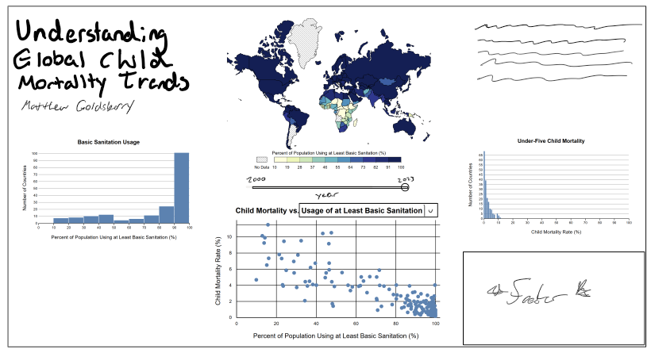

This approach shared the central focal point between the scatterplot and choropleth map. This helped to make sure that the choropleth received valuable space, but would require the user to toggle it between the data it was focussing on.

#### Approach 2: "The Central Hub"

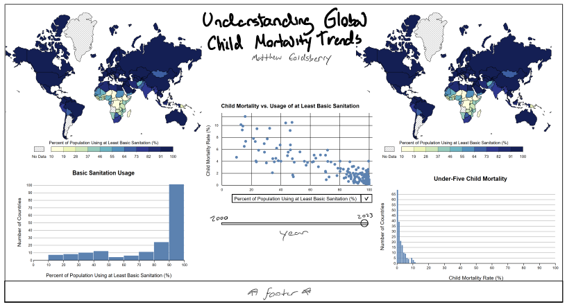

This approach had the scatterplot as the sole "central hub", with each axis having its own column on either side of it. Each column would contain the axis title, choropleth map, bar chart representing that specific data. This had substantially less whitespace than the first approach did.

#### User Testing

Approach 2 was my favorite of the two, but I wanted to verify this with fresh eyes. So to finalize my decision I presented the sketches to some peers and gather their thoughts one which was more visually appealing and they would imagine better enable learning from the data. The unanimous decision was Approach 2. One of the main reasons for the favor of Approach 2 was that it didn't require the user to toggle between datasets being represented in the choropleths, but would rather allow them to easily see and compare both.

??? note "Differences between Approach 2 and Final Implementation"
    While Approach 2 was chosen, the final implementation did change slightly from the sketch. I wanted to take a moment to highlight some of the more major differences: 

    * The data columns were flipped such that the y-axis would be on the left and the x-axis on the right, to match the ordering of the scatterplot title.
    * The selection of the feature to compare against was moved from the x-axis label of the scatterplot to the title of the x-axis bar chart and choropleth.

## Visualization Components & Interactions

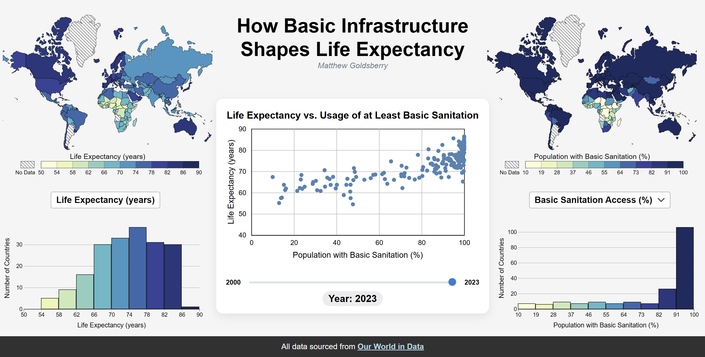

The dashboard relies heavily on **Brushing/Selecting/Hovering and Linking**, meaning an interaction in one component immediately updates all others. To reset any selection, the user simply presses the `Escape` key. To unselect any selected component, the user simply clicks the country, point, or bin to unselect that country(ies).

### The Central Scatterplot

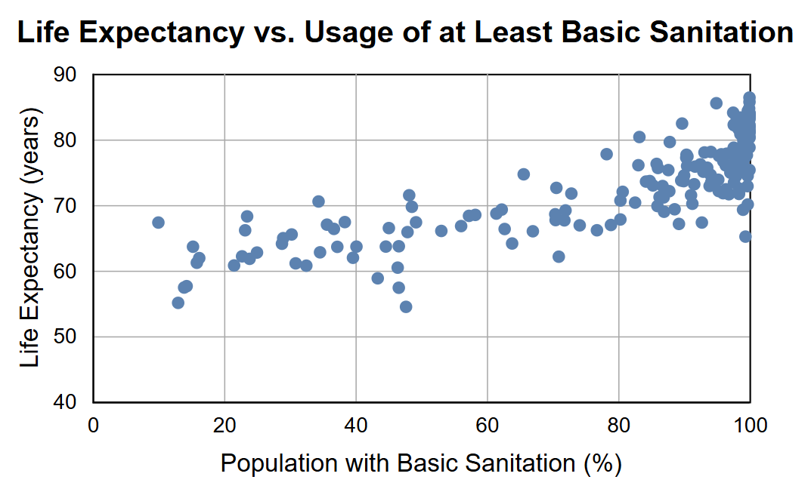

**What this shows:** Life expectancy (Y-axis) plotted against the selected infrastructure metric (X-axis).

**Interactions:** Users can hover for tooltips that shows the country name and datapoints, click to select a specific country, or use a **brushing tool** to select a cluster of countries, as seen in the example below.

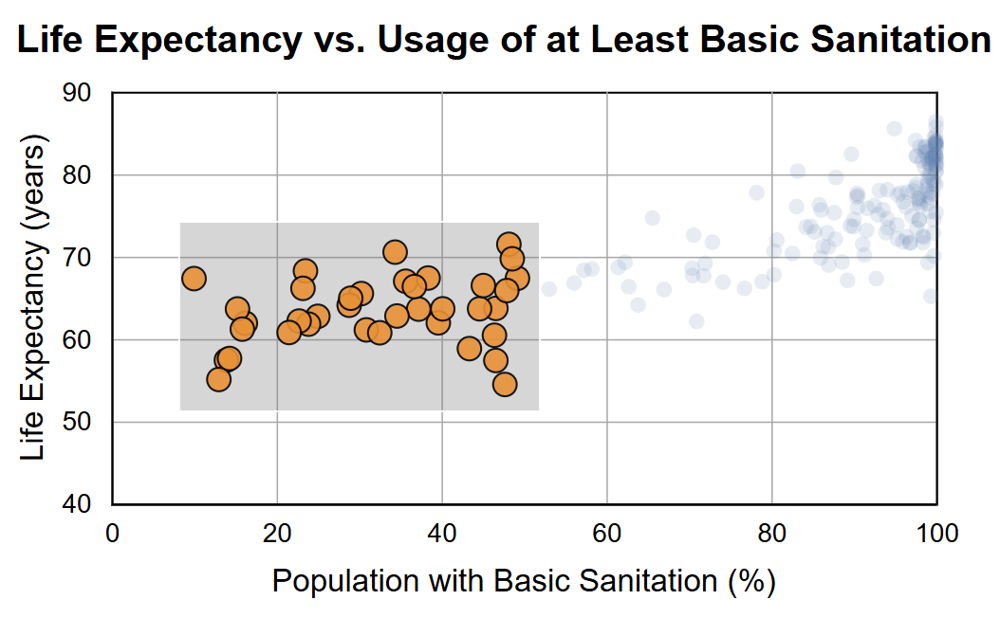

### Bar Chart

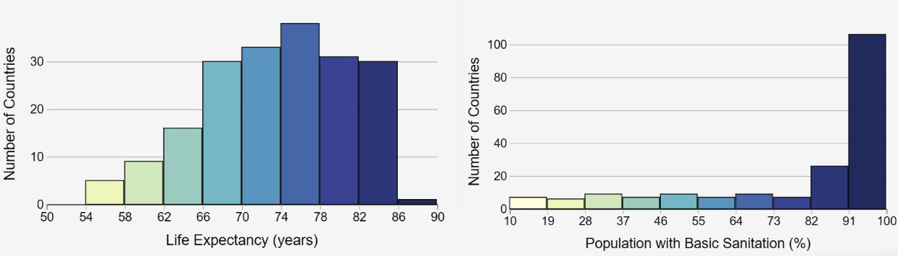

**What it shows:** The distribution of countries across binned ranges of the data.

**Interactions:** Users can hover over a bin to temporarily highlight all countries within that range across all five visualizations. Clicking a bin persists this focus, allowing users to isolate specific range groups (e.g., countries with a life expectancy of 74-78 years).

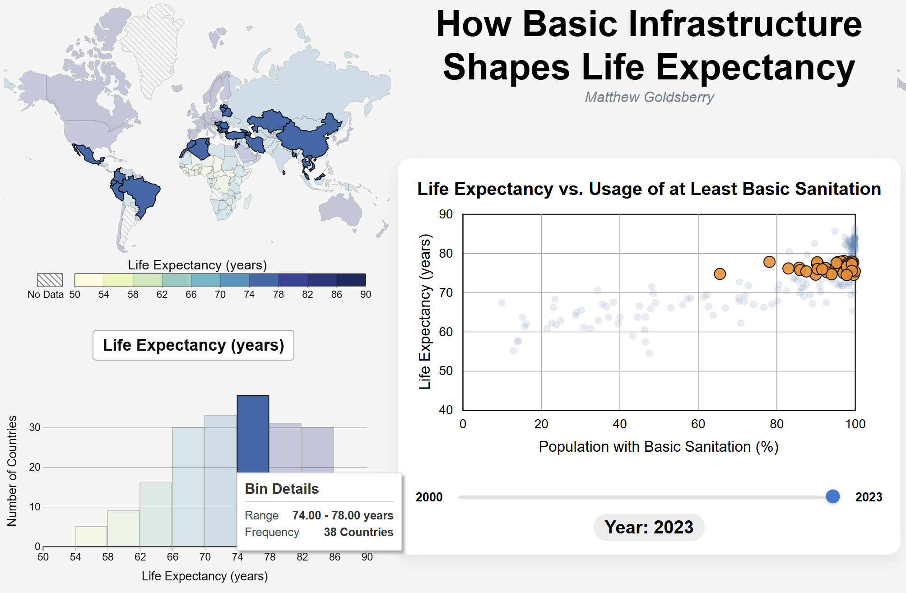

### Choropleth Maps

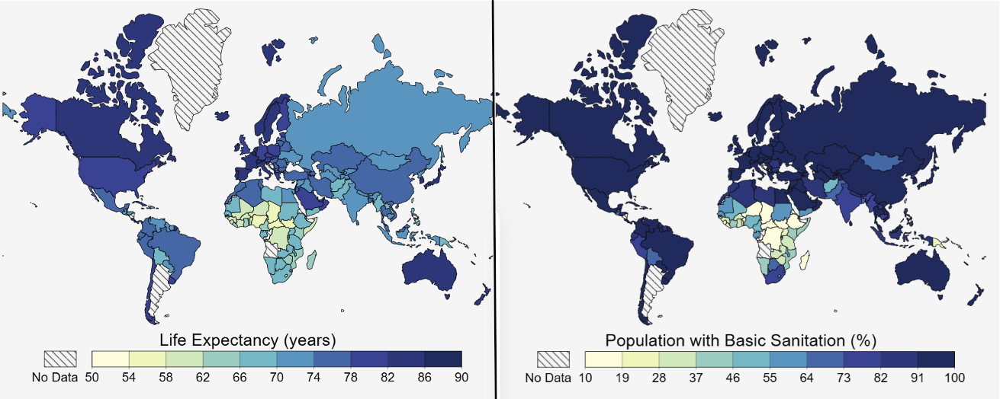

**What it shows:** A global geographic view, color-coded using the exact same data bins generated by the bar charts.

**Interactions:** Supports hovering and click-to-select by specific country boundaries.

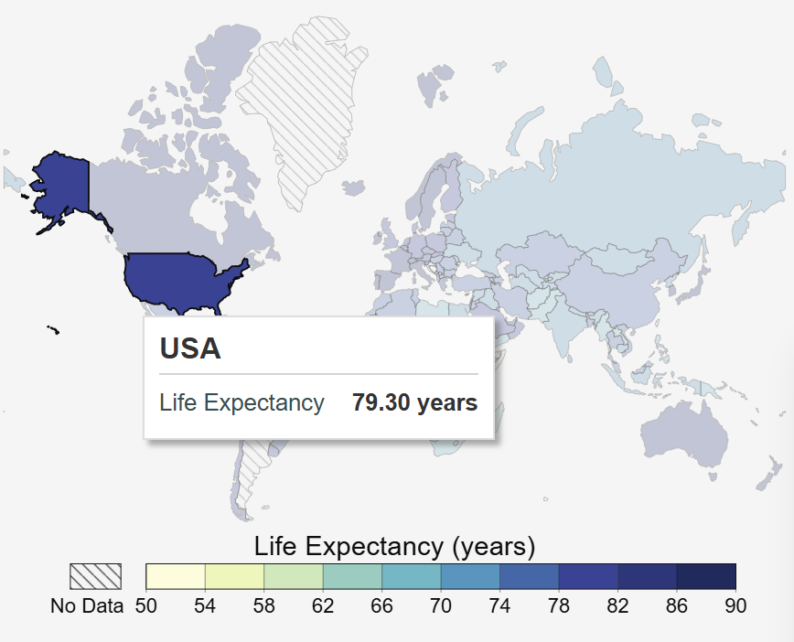

### Global Interactions

#### Year Slider

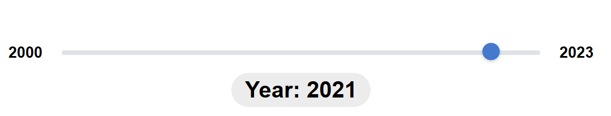

Allows users to control the active year. Selections also persist, allowing the user to view how a specific cluster of countries evolves over time by sliding the slider (as seen in the demo).

#### X-Axis Dataset Toggle

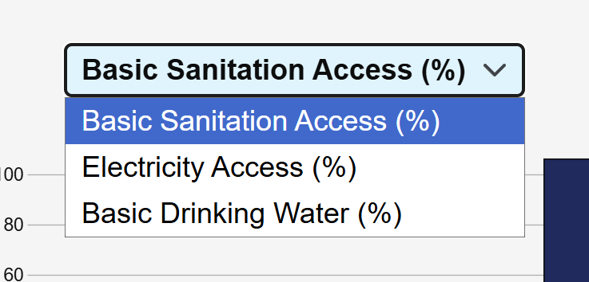

A dropdown to switch the infrastructure metric being analyzed (Water, Sanitation, or Electricity). The selections will also persist through changes in the dataset.

## Key Discoveries & Findings

The following case studies demonstrate how the dashboard’s interactive features can be leveraged to uncover global trends, historical anomalies, and outliers.

### Finding 1: The "Development Surge" (2000–2023)

By using the brushing tool to select a group and the choropleth maps to limit that selection down to a specific region, focusing on Indonesia, India, Laos, Bhutan, Cape Verde, Nepal and Cambodia, we can see a clear historical trend in that region.

By interacting with the year slider, we can see a "development surge" from 2000 to 2023 where these countries significantly improved their basic infrastructure. In the scatterplot we can see the direct, positive correlation that as the dots move right, exhibiting a increase in infrastructure, the life expectancy also improves.

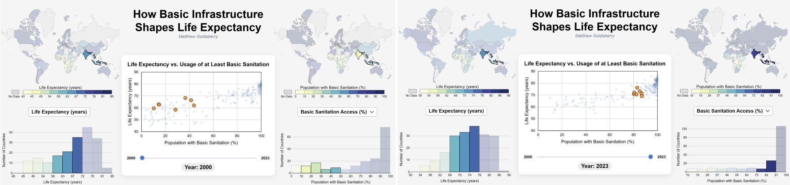
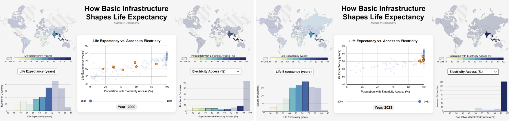
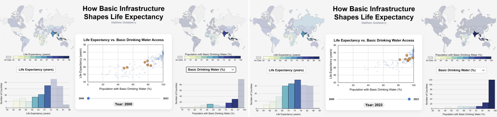

### Finding 2: Infrastructure Decoupling in the Common Trend with Zimbabwe

While the data typically shows a positive correlation between infrastructure and life expectancy, Zimbabwe exhibits an exception. By isolating Zimbabwe and tracking it over time, it can be seen that while the many of its basic infrastructure remains the same (even worsening in some cases) the life expectancy still consistently grows.

This shows that while the infrastructure can help give us hints towards the life expectancy of a country, it does not always hold true.

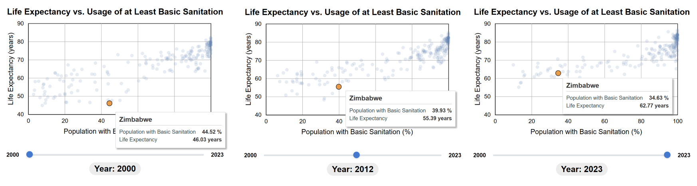

### Finding 3: An Outlier in Nauru

While exploring with the bar charts I noticed that there were a couple of outliers where life expectancy was abnormally low for a few countries in the highest percentage of infrastructure access. A couple of them were related to war going on in them, but the one that exhibited this behavior consistently was Nauru, which has very high access to infrastructure but a pretty low life expectancy.

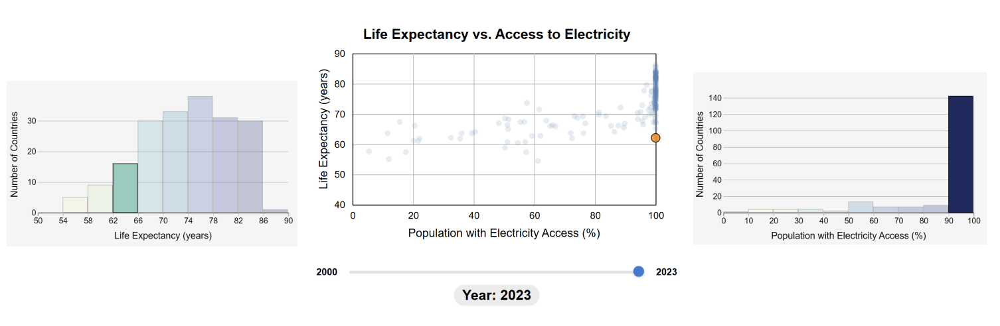

## Technical Implementation

### Tech Stack

#### Python (Data Pipeline)

**Tools & Packages:** [`uv`](https://docs.astral.sh/uv/), [`ruff`](https://docs.astral.sh/ruff/), [`ty`](https://docs.astral.sh/ty/),[`Pandas`](https://pandas.pydata.org/docs/), [`Requests`](https://requests.readthedocs.io/en/latest/), [`tabulate`](https://pypi.org/project/tabulate/), and [`pycountry`](https://pypi.org/project/pycountry/18.5.20/)

Python was used for the data pipeline primarily due to `Pandas`' ability to easily read and edit CSV data.

#### JavaScript, HTML, CSS (Frontend)

**Packages:** [`D3.js`](https://d3js.org/)

`D3.js` was selected for its powerful capabilities in creating data visualizations. Using the basic frontend setup with D3 offered parity with what was taught in class and provided examples and allowed for granular control over the visualizations.

### Architecture

#### `prepro/` (Data Pipeline)

Contains Python scripts to fetch (`pull_csv.py`, `pull_json.py`), clean, and merge (`join_datasets.py`) the data. It includes logic to create consistent naming conventions and removes any incomplete rows to ensure integrity of the dataset used in the frontend.

#### `app/` (Application)

Contains class-based visualizations modules (`Scatterplot`, `Histogram`, and `ChoroplethMap`). Also contains common functions and event handlers used to allow interactions (hovering, clicking, and brushing) and synchronization of those interactions between visualizations.

### Running Locally

To run this locally:

1. Clone the repository and navigate to the directory

    ```bash
    git clone https://github.com/MatthewGoldsberry/A-World-of-Data.git
    cd A-World-of-Data
    ```

2. Launch a local web server (I used Python to do this)

    ```bash
    python -m http.server
    ```

3. Access the application at [`http://localhost:8000`](http://localhost:8000)

## Challenges & Future Work

### Challenges

**Binning Consistency:** I ran into a problem where the default behaviors of the bins created in the choropleth maps (`d3.scaleQuantize`) and the bar charts (`d3.bin`) were inconsistent. Specifically, `d3.scaleQuantize` resulted in exact bins while `d3.bin` would round to "nice" multiples (e.g., multiples of 5). To solve this, I wrote a helper function, `calcBinInfo`, to generate explicit threshold values based on the provided data's extent. I could then take these explicit thresholds and domains to the visualization methods to create exact bins, putting the responsibility and control on me, as opposed to D3. This also got leveraged latter on to edit te y-axis ticks on the scatterplot to accomplish the exact behavior I wanted.

**State Management & Event Handling:** Coordinating highlight and selection states across five distinct SVG components in JavaScript also presented some challenges. To tackle this, I opted to look specifically, class-by-class, writing the logic needed to implement the behaviors for that visualizations in a modularized form to allow them to fit into the future classes, barring minor tweaks. I also separated the highlighting from the selection which made the conceptual load of implementing each a little easier and resulted in a grouping of reusable helper functions. These helper functions handle the global state, highlighting, unhighlighting, selecting, and unselecting countries across all visualizations. The visualization classes where then responsible only for catching the event, passing the countries to these methods and populating the tooltips with text.

### Future Work

1. **Refactoring:** I plan to revisit the codebase to refactor the JavaScript implementation. This was my first major project using JavaScript, I would like to take some time to look back at the code and learn ways to better write the functionalities I implemented and hopefully get a firmer grasp on JavaScript all-together.
2. **UI Enhancements:** I hope to add two UI features to increase ease of use of the application. First, would be to make the legend interactive, similar to how the bins in the bar charts are were a group of countries can be selected. Second, would be a click off visualization to unselect.
3. **Solving Overplotting:** I would like to experiment with ways to better visualize the dense clusters of data to the user. In the scatterplot a lot of points would group together towards the top and it would be hard to select a specific one and make a ton of sense out of it. Maybe something like a zoom-to-cluster feature that would expand a cluster if hovered over?

## Acknowledgements & AI Usage

**Acknowledgements:**
A huge thank you to Professor Aurisano for the feedback on the visualizations, and to my roommates for assisting with UI validation and deployment testing.

**AI Collaboration:**
I utilized AI in a few different ways in this project. Since I am still pretty new to frontend syntax, I used AI to help generate some of the CSS to help me achieve the layouts I had envisioned to be displayed on the screen. I also used it occasionally to help me write some of the JavaScript, since this is my first time heavily using JavaScript, I was lacking in some of the behavior and syntactical knowledge. So there would be times where I would know exactly what I wanted to code to do, but not the JavaScript syntax to accomplish that specific task. There were also a couple of times were I would be completely stuck on a bug or error that I was running into and would use it to help me fix it.
