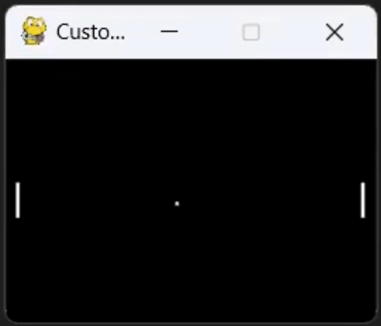
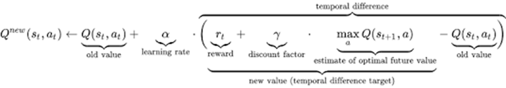

# Smart Pong

## Overview

"Pong From Pixels" was part of an experiential learning program through [Discovery Lab Global](https://www.discoverylabglobal.com/).  
I completed this project after my freshman year of college, with limited programming experience and almost no prior exposure to machine learning or AI.  

The challenge was simple: build an AI agent to play Pong, with no instructions beyond a reference to [Andrej Karpathy's *Pong From Pixels* blog post](http://karpathy.github.io/2016/05/31/rl/).  

This project demonstrates how a reinforcement learning agent can learn strategy, make decisions from raw observations, and improve performance autonomously, providing early exposure to Q-learning and AI development.

## Pong Environment Setup

### Overview

A custom Pong environment was implemented in Python using [PyGame](https://www.pygame.org/) as a testbed for reinforcement learning agents. It mimics the classic Atari Pong game, providing a simplified yet interactive environment where an agent controls a paddle against a computer-controlled opponent.

<figure markdown="span">
  { width="250" }
</figure>

### Agent Interaction

The agent has discrete actions — moving the paddle up, down, or staying in place — and receives normalized observations of the game state, including the positions of the ball and paddles.

### Game Dynamics and Rewards

The environment handles paddle and ball movement, collisions, scoring, and episode termination. The opponent follows a simple reactive strategy, tracking the ball’s vertical position. Rewards are assigned at the end of each episode (+1 for winning, -1 for losing), providing clear feedback for learning.

### Purpose

This setup provides a consistent, flexible platform for evaluating and training reinforcement learning agents, with control over key factors influencing learning outcomes.

## Solution: Q-Learning

This project uses [Q-Learning](https://www.geeksforgeeks.org/machine-learning/q-learning-in-python/), a foundational reinforcement learning algorithm that allows an agent to learn optimal behavior through trial and error. The agent gradually updates its understanding of which actions lead to long-term success, even when rewards are delayed, making Q-Learning ideal for dynamic, real-time games like Pong.

### Why Q-Learning?

Q-Learning was chosen for three reasons:

1. **Model-Free Learning** — The agent does not require prior knowledge of the game’s physics or rules. It learns purely from experience.  
2. **Delayed Reward Handling** — Many actions do not produce immediate feedback. Q-Learning excels in environments where rewards occur several steps later.  
3. **Interpretability** — Q-Learning produces an explicit value table, making the agent’s reasoning transparent, analyzable, and explainable.

### Decision Making

At the core of Q-Learning are **Q-values**, which estimate the expected cumulative future reward of taking a specific action in a specific state.

- **State**: A representation of the current game situation  
- **Action**: A possible move the agent can take  
- **Q-value**: An estimate of how beneficial that action is in that state, considering immediate and future rewards  

The agent’s objective is to learn Q-values that maximize long-term success, enabling it to select the best available action consistently.

#### Q-Values

Q-values are stored in a Q-table, where each entry corresponds to a *(state, action)* pair. For a simplified example:

**States**

- **Above** — ball above the paddle  
- **Aligned** — ball aligned with the paddle  
- **Below** — ball below the paddle  

**Actions**

- **Up** — move paddle up  
- **Stay** — do nothing  
- **Down** — move paddle down  

| State   |   Up   |  Stay  |  Down  |
|:-------:|:------:|:------:|:------:|
| Above   | -0.45  | -0.60  | -0.80  |
| Aligned |  0.75  |  0.90  |  0.10  |
| Below   | -0.70  | -0.55  |  0.20  |

By comparing Q-values, the agent anticipates which actions will likely lead to winning, even if success comes several moves later.

#### How Q-Tables Are Used

When the agent observes the current state, it:

1. Retrieves all Q-values for that state  
2. Selects the action with the highest Q-value  

For example, if the ball is **Aligned**:

- **Move Up** - 0.75  
- **Stay** - 0.90  
- **Move Down** - 0.10  

Since **Stay** has the highest Q-value, the agent chooses that action, enabling fast, consistent decision-making.

### Learning

Q-values are continuously updated using the **Bellman Equation**, which combines immediate feedback with an estimate of future outcomes.

<figure markdown="span">
  { width="750" }
</figure>

At a high level, the Bellman update answers:

> *“How good was this action, given what happened immediately and what I expect to happen next?”*

Each update nudges the Q-value toward a better estimate of long-term reward.

??? info "In-Depth Explanation of the Bellman Equation"
    The Q-learning update:

    ```
    Q(s, a) ← Q(s, a) + α [ r + γ max Q(s′, a′) − Q(s, a) ]
    ```

    **1. Estimate the Best Possible Future**  
    ```
    max Q(s′, a′)
    ```
    This predicts the best outcome achievable from the next state, assuming optimal future decisions.

    **2. Discount the Future**  
    ```
    γ max Q(s′, a′)
    ```
    Future rewards are uncertain, so they are slightly discounted:
    - **γ ≈ 1** → long-term planning  
    - **γ ≈ 0** → short-term, reactive behavior

    **3. Form a New Target Value**  
    ```
    r + γ max Q(s′, a′)
    ```
    Combines immediate reward with best expected future outcome.

    **4. Calculate the Temporal-Difference (TD) Error**  
    ```
    target − Q_old
    ```
    Measures how wrong the previous belief was:
    - Positive → action better than expected  
    - Negative → action worse than expected

    **5. Update the Q-Value**  
    ```
    Q_new = Q_old + α (target − Q_old)
    ```
    Gradually adjusts the Q-value toward the new estimate.

??? info "Step-by-Step Update Example"
    - **Current state**: Above  
    - **Action**: Move Down  
    - **Current Q-value**: −0.80  
    - **Reward**: 0  
    - **Best future Q-value**: 0.90  
    - **Learning rate (α)**: 0.1  
    - **Discount factor (γ)**: 0.9  

    ```
    Q_new = -0.80 + 0.1 [ 0 + 0.9 × 0.90 − (−0.80) ]
    Q_new = -0.80 + 0.1 [ 1.61 ]
    Q_new = -0.639
    ```

    Even without immediate reward, the action led to a state with high future potential. Over many iterations, these incremental updates produce increasingly effective gameplay.

### Key Takeaway

Q-Learning allows the agent to:

- Learn from delayed rewards  
- Improve behavior without explicit instructions  
- Develop strategy through interaction and feedback  

Rather than memorizing actions, the agent learns a value-based understanding of the game.

## Training

Training explored how structure and stopping criteria affect learning stability:

1. **Open-ended training** — revealed oscillation and inconsistent convergence  
2. **Goal-oriented training** — defined performance thresholds, leading to faster, more stable learning  

> Well-defined success criteria can matter more than raw training volume.

## Results / Outcomes

The final agent achieved strong performance:

- **Consistent gameplay**: Maintained an almost perfect win streak against the baseline opponent  
- **Efficiency over brute force**: Minimal training produced a capable agent, showing **quality of training episodes outweighs quantity**  
- **Real-time adaptability**: Adjusted dynamically to the ball and opponent behavior, demonstrating learned strategy

The following video demonstrates the agent learning in real time, showing the progression from exploratory behavior to stable strategy:

<figure markdown="span">
  <video controls loop muted playsinline width="700">
    <source src="/assets/media/smart-pong/pong-learning-demonstration.mp4" type="video/mp4">
    Your browser does not support the video tag.
  </video>
  <figcaption>SmartPong AI learning paddle control through Q-learning</figcaption>
</figure>

> Technical documentation provides a deeper dive into the Q-learning implementation and training pipeline.

## Future Directions

Potential extensions include:

- **Adaptive exploration** — decaying or state-dependent epsilon to balance exploration/exploitation  
- **Stronger opponents** — adaptive adversaries to increase challenge  
- **Richer reward shaping** — nuanced rewards to encourage advanced positioning and strategy

## Additional Outcomes & Impact

I presented the SmartPong program at Discovery Lab Global during the **Ohio Defense and Aerospace Forum (2024)**, sharing my perspective as a program participant and using the AI project to illustrate how the program supports workforce development. I engaged with industry professionals, educators, and students across defense, aerospace, and technology sectors.

<figure markdown="span">
  { width="350" }
  <figcaption>Presenting SmartPong AI at the Ohio Defense and Aerospace Forum (2024)</figcaption>
</figure>

I co-authored a **450+ page technical document** for the project, covering implementation, reinforcement learning theory, and broader AI context. All concepts referenced here are detailed in that document. To improve accessibility, I created a **condensed 30-page excerpt** highlighting key design decisions and connections to modern AI research, including *Pong from Pixels* (Karpathy), *Attention Is All You Need* (Vaswani et al.), and the use of ChatGPT as a development aid.

> **[Download the 30-Page Technical Excerpt](../assets/docs/smartpong-technical-excerpt.pdf)**

---

**[View the GitHub Repository](https://github.com/MatthewGoldsberry/PongAI-QLearning)**
