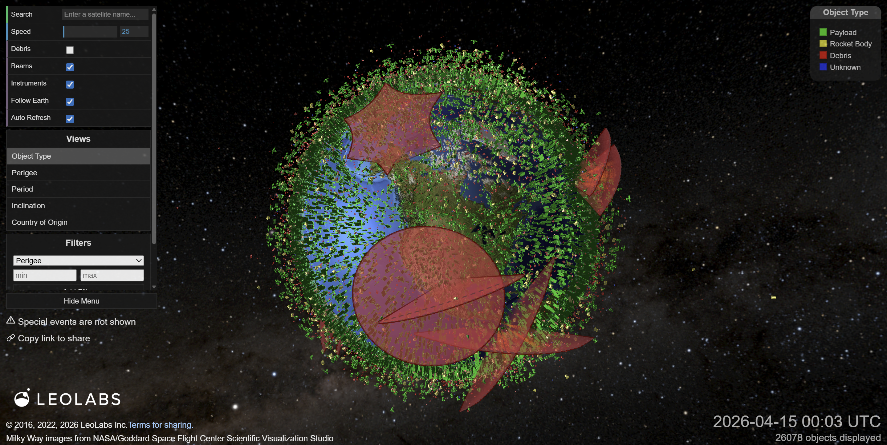
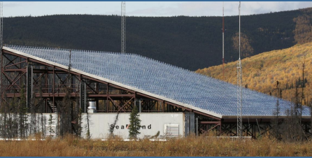
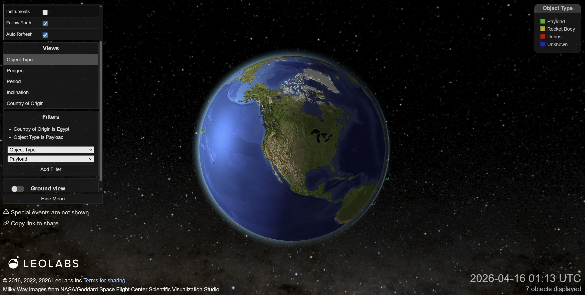
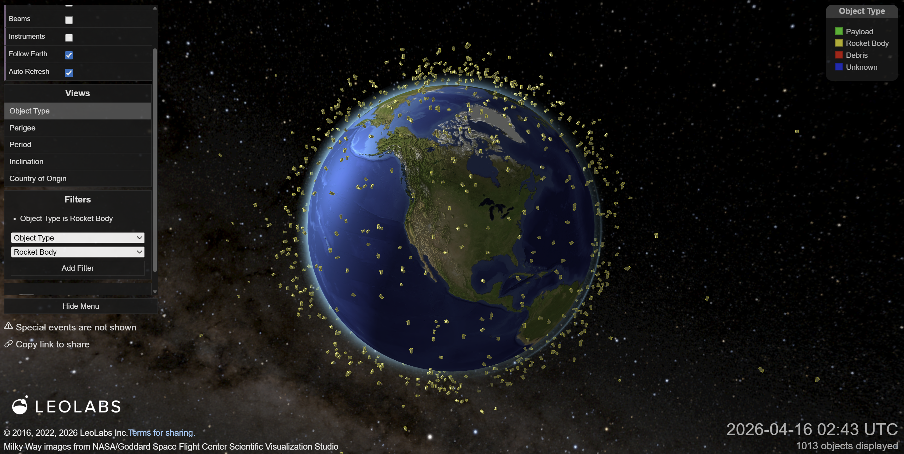
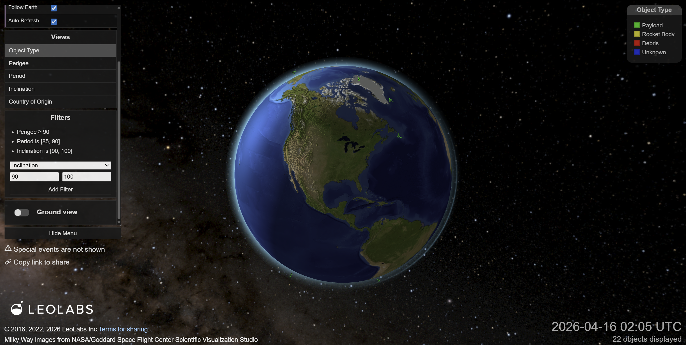
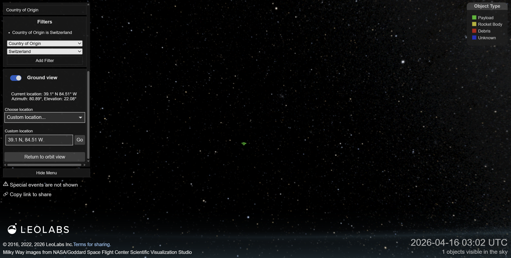
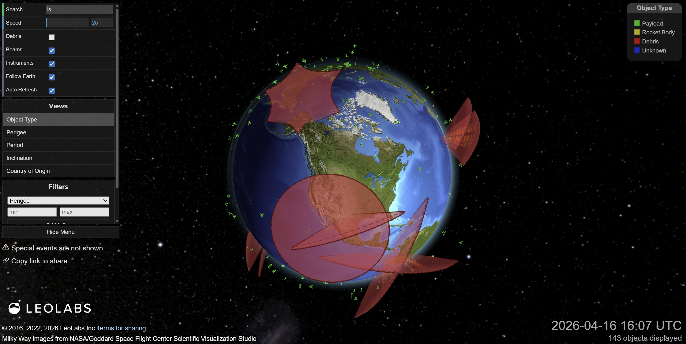
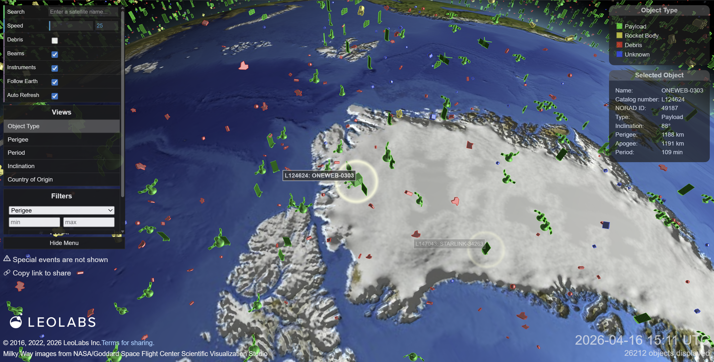
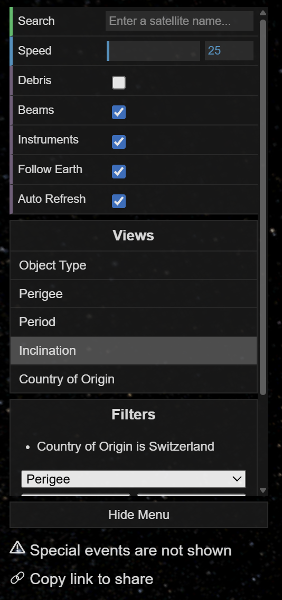

# [Low Earth Orbit Visualization](https://platform.leolabs.space/visualization) Critique

## Motivation

My motivation behind analyzing this specific visualization stems from my involvement in the Cubecats organization. Very recently, we watched our cube satellite, LEOPARDSat-1, get launched on the NG24 resupply mission, and it is currently docked on the ISS. In the coming weeks, the satellite will be deployed from the ISS into low Earth orbit to start collecting and transmitting our experimental data. Moreover, I am currently working on the ground station software that processes telemetry data to determine our next transmission windows. Seeing a visualization of satellite locations is not only highly relevant to my work, but it is also incredibly exciting to know that in a few weeks, I will be able to track our own satellite on this map.

## Introduction

This visualization's general goal is to provide an interactive map of low Earth orbit (LEO) objects. It highlights the densities and trajectories of active satellites, space debris, and tracking instruments. The main, underlying goal of this visualization, however, is to serve as a public-facing teaser for LeoLabs' commercial platform and proprietary data.

I view this as having two primary audiences. The first consists of commercial/government entities utilizing this information (likely from the commercial API and not solely this visualization) for operations, such as something like collision avoidance and monitoring orbital traffic. The second audience would be space enthusiasts and amateurs - like myself - who are interested in tracking the satellites and objects orbiting Earth. Regardless of the user type though, the interface definitely has a slight domain knowledge requirement to draw extremely meaningful conclusions from it.

## The Data

The core data visualized in this tool consists of spatial coordinates and trajectories of LEO objects. Visually, this is represented via a 3D model of Earth paired with basic metadata on the objects, such as the name and type. Altitude and velocity are also visually represented by the location and movement of the objects in the 3D model. However, this visualization represents only a simplified subset of the granular data that can be obtained via LeoLab's commercial APIs.

This data is empirical. It is continuously captured via LeoLabs' proprietary global radar network. This network consists of ground-based, phase-array radars positioned around the globe (which are also represented in the visualization as instruments). These radars track objects as they pass overhead, calculating the velocity and trajectory. This data is then passed to the visualization to update the orbital map. An example of one of these tracking sites, located in Alaska, is shown below.

## Questions & Insights

This visualization allows users to make general observations but also to move a step beyond that and perform "targeted queries" if they know what they are looking for. The interface provides a very robust filtering system for these objects that allows you to answer some more specific questions. For example, I as the user might wonder, "what active satellites in LEO originate from Egypt?" To answer this question I would simply apply a `Country of Origin` filter to Egypt and the `Object Type` filter to Payload (which is synonymous to active satellites in this particular context). This allows me as the user to easily strip away the massive clutter and learn some more about these satellites from Egypt.

Or if I had a slightly more general question of just wanting to see all of the rocket bodies that are in LEO, I could clear the filters from the previous question and add a filter of `Object Type` set to Rocket Body.

Stepping up the technicality of the question we can jump into the user potentially asking questions about understanding the object's behavior and data reliability.

* **Pedigree:** This refers to the age of the tracking data. In this context, a high pedigree means the object has been recently and frequently observed by the radar network which results in more accurate predictions of the position.
* **Period:** Time (in minutes) it takes for an object to complete one full revolution around the Earth. This allows users to filter at specific altitudes (as altitude impacts period), which can be helpful for identifying clusters of objects at the same altitude.
* **Inclination:** This is the angle of the orbit relative to the Earth's equator, meaning at 0 degrees the object orbits around the equator while 90 degrees it is in a polar orbit (over the poles of the Earth). This can help a user figure out if a satellite is meant for global coverage or not.

Putting this all together into a question I might ask "what are highly-tracked satellites operating in polar orbits at an altitude similar to the ISS?" To find the answer to this I would have to set the `Pedigree` to >= 90, `Inclination` to >= 85 degrees, and `Period` to [90, 100] minutes (approximate orbital period of the ISS).

Then the ground view also offers the ability to answer some different questions and insights. For example, if I wanted to see how Switzerland's satellites pass over from Cincinnati I could specify the custom location with the latitude and longitude of Cincinnati and interact with the view to see the satellites as they passed over the Cincinnati.

## Visual and Interaction Design Choices

This visual is very aesthetically pleasing. The 3D interactive globe setup on the milky way is a very sharp look. They also do a great job applying proper coloring, in my opinion, for each of the different views which make the data being shown easy to follow. The also use differing icons to represent different objects and different satellites which is not only visually cool, but also allows for the additional layer of information to be presented without introducing additional clutter. The most fundamental interactions such as panning, zooming, and changing from space view to ground view were all very smooth and straight forward as well. The search bar is also a well done feature, it dynamically updating the view with each character typed I think is a really well done design and helpful for searching.

Another really strong aspect of this interaction design is the hover behavior. When you hover over an object, a circle appears around it, making it really easy to identify what object is hovered/selected (and also providing its name). The hover selection persists briefly before fading, allowing you to smoothly explore a cluster of objects. Additionally, this interaction is only limited to the named objects which helps when navigating with all debris included. My favorite feature of this visualization is when you select an object. When you do this, it follows the object in its orbit around Earth, as well as provides some additional metadata.

However, this interaction design is very hands-off when it comes to helping the user which I think is a major missed mark on their part. The options presented to the user for controlling the visualization do not provide any guidance. If these were simple things I might be alright with that, but the options are more technical terms that the average Joe probably will not know what they mean. Furthermore, when it comes to applying the filters there is not any guidance as to what the values are and mean which leaves the burden completely on you to know the correct values to place in the min or max fields of the filter. This could easily be solved with just some tooltip interactions or info icons so when things were hovered, additional information would be provided to the user to help them more easily gain valuable insights from them.

## Limitations

There are three major limitations to this visualization.

First, is the data paywall. While this visualization is visually appealing and presents a captivating view of LEO objects, it lacks depth. This is intentional, and makes sense when considering the underlying goal of this visualization, which is to acquire customers for their commercial API. If they provided all of their data, there would be no reason for a customer to purchase their API.

Second is the cognitive load required to actually leverage all of the tool's features. As noted in the previous section, there are filters, views, and variables that are not necessarily common knowledge. This requires a user to have a pre-existing understanding of LEO objects and what different values of things like pedigree, period, or information mean. Since this visualization provides no additional context or help, this responsibility falls completely on the user.

Third is the speed control. There is no information about what the speed control actually is, or what units it is in. I would assume it is a multiplier given the behavior but there is nothing to affirm this.
