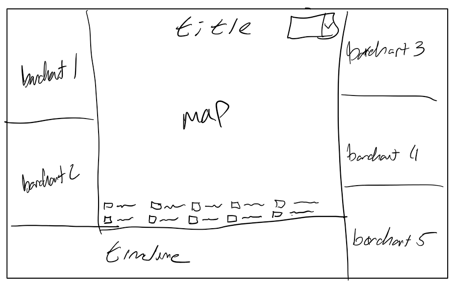
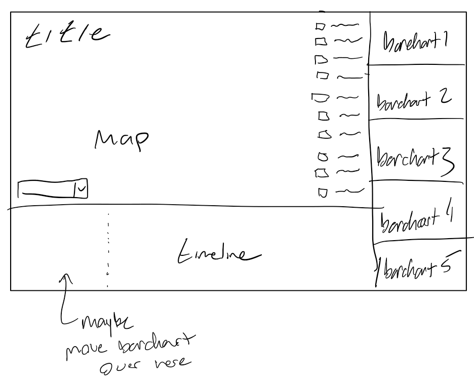
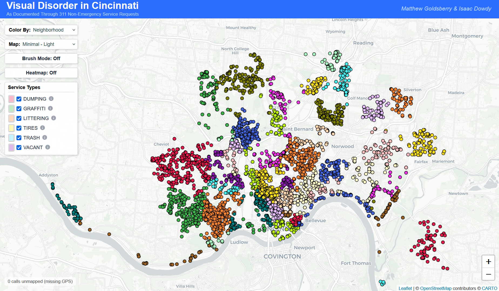
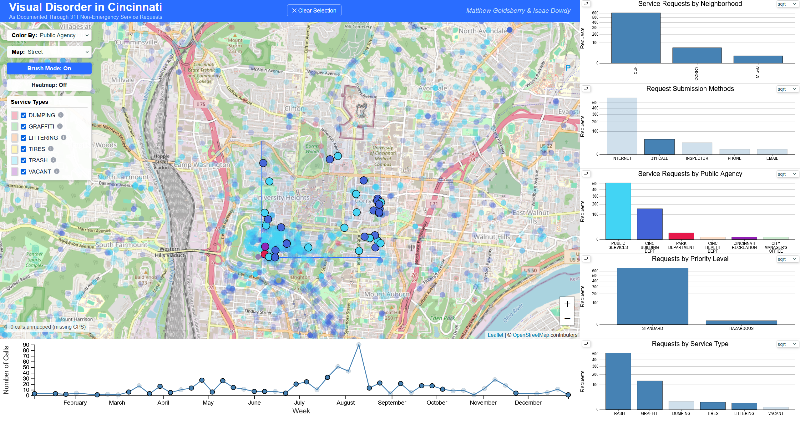
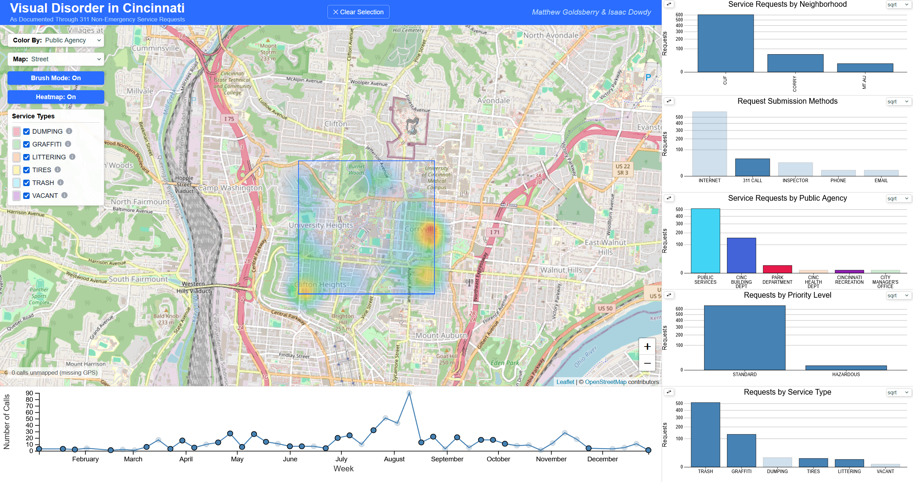
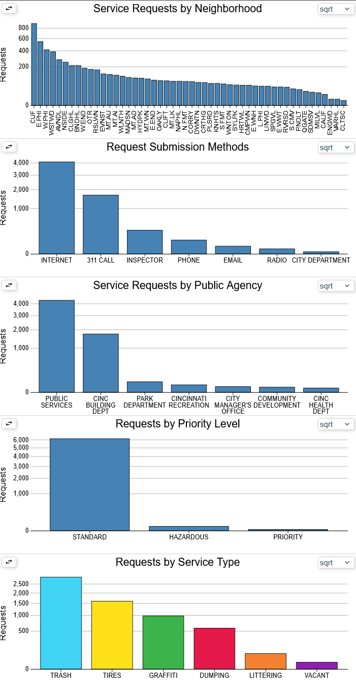
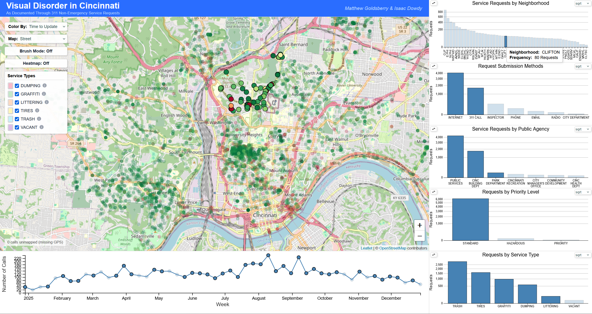
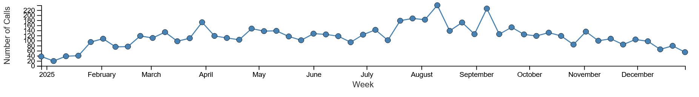

# Who You Gonna Call? 3-1-1!: Visual Disorder in Cincinnati

**Team Members:** [Matthew Goldsberry](https://github.com/MatthewGoldsberry) & [Isaac Dowdy](https://github.com/isaac-dowdy)

**Links:** [Live Application](https://visual-disorder-in-cincinnati.vercel.app/) | [Source Code (GitHub)](https://github.com/MatthewGoldsberry/Who-you-gonna-call) | [Demo Video](#video-demonstration)

---

## Project Overview & Motivations

This project is an interactive data visualization designed to help users explore and understand patterns in 311 service requests made to the City of Cincinnati in 2025, with a focus on issues related to visual disorder.

* **The Problem:** The data for this project was presented in one large CSV file with many attributes and data points, an accurate example of how data looks in the world. Data like this cannot be easily visualized through tables or in a static report, and, without effective visualizations and linked views of the data, it can be challenging to identify trends and draw comparisons from the data.
* **The Goal:** This application allows users to explore Cincinnati's 311 service request data through a synchronized dashboard containing a map and different charts. By interacting with the linked views, users can isolate specific neighborhoods, time periods, or request types and observe how patterns and trends change across the city. This application would not only be helpful in gaining information on visual disorder in Cincinnati, but also in coming up with creative ways to approach and solve these problems.

## Video Demonstration

<figure markdown="span">
  <video controls loop muted playsinline width="700">
    <source src="" type="video/mp4"> 
    Your browser does not support the video tag.
  </video>
</figure>

## The Data

The datasource of this project is the [Cincinnati 311 Non-Emergency Service Requests dataset](https://data.cincinnati-oh.gov/efficient-service-delivery/Cincinnati-311-Non-Emergency-Service-Requests/gcej-gmiw/about_data), sourced directly from the City of Cincinnati's Open Data Portal.

The 3-1-1 system handles every non-emergency request in the city, meaning the raw dataset was massive and broad in scope. It contained over 381 distinct service request types (`SR_TYPE`) spanning 17 different departments. To align with the focus of our project, **Visual Disorder**, this data needed to be filtered and cleaned into a focused subset.

### Filtering for Visual Disorder

Visual disorder can be more broadly defined as instances of visual blight and environment disorder. This required narrowing down those 381 different service types into 6 core, human-readable categories: **Dumping, Graffiti, Littering, Tires, Trash, and Vacant Properties**.

To achieve this, we aggregated several related raw service codes into consolidated categories:

* **Graffiti:** Combined `GRFITI`, `GRFITI-H`, `GRAFPARK`, and `GRFTRPRV`.
* **Littering:** Combined `LTTR-BLD`, `LTTR-CDV`, `LTTR-PRK`, `LTTR-REC`, and `LTTRRST`.
* **Trash:** Combined `TRASH-E`, `TRASH-I`, `TRASH-L`, and `TRASH-RE`.
* **Dumping:** Mapped from `DUMP-PVS`.
* *(Tires and Vacant properties were mapped directly from their respective individual codes).*

### Data Processing & Subsetting

To extract these insights and generate our final dataset used in the application, we develop two basic Python scripts.

1. **Data Exploration** ([`data/data_exploration.py`](https://github.com/MatthewGoldsberry/Who-you-gonna-call/blob/main/data/data_exploration.py)): Because the dataset was so large to start with, we wrote a basic script using Python's native `csv` library to parse the file and extract sets of values for priorities, departments, neighborhoods, and service types. This allowed us to see exactly what we were working with in those specific categories.
2. **Subsetting & Normalization** ([`data/subset_creation.py`](https://github.com/MatthewGoldsberry/Who-you-gonna-call/blob/main/data/subset_creation.py)): Once we identified the target codes, we leveraged the `pandas` library to clean and filter the data. Specifically, we filtered down the original dataset to only include the service types we wanted to target. Then we normalizes the service types in consolidated groups with human-readable labels.

## Design Process & Early Sketches

At the start of the project, we established a requirement ourselves: the application must function as a single view with no scrolling. This constraint helps ensure that when a user interacts with a component, the filtering effects across all other visualizations are immediately visible to the user, without losing context.

### Initial Concept

The geographical interaction is the obvious driver of this data exploration, so the Leaflet map must be the centerpiece of the application. The secondary challenge to the layout was there were a lot of visualizations to add outside of just the Leaflet map, with 5 other bar charts and a timeline needing to be included. When designing the layout and estimating the sizing of the SVGs we had a strict mental requirement to ensure that all datapoints remained legible and easily intractable, making sure that no elements were to small to click or hover.

### Sketches

With these constraints in mind, we developed two early sketches to layout potential spatial arrangements. From this two primary layouts emerged:

#### Approach 1: Dual Chart Columns

This approach surrounds the central Leaflet map with visualizations, dividing the bar charts across both the left and right margins. While this approach maximizes the total screen area dedicated to the charts, it crows the center and constrains the map's overall width.

#### Approach 2: Single Chart Column

This approach consolidates all 5 bar charts into a single column on the right. This dedicates a much larger block of space for the Leaflet map and a little larger space for the timeline tool at the bottom. *(Note: This sketch also includes an early annotation exploring the possibility of utilizing the bottom-left quadrant for chart overflow).*

#### Decision and Validation

After evaluating both options, we went with **Approach 2**. The reasoning behind this was surrounding optimizing the spatial geometry:

* **More Ideal Aspect Ratios:** Combining the bar charts into a single column provided a more rectangular bounding box that better suited the horizontal nature of bar charts.
* **Map Size:** The Leaflet map required as much space as we could comfortably give it because of the known additions to come with specific controls that would take up some of its space. Approach 2 offered the largest amount of space to the map.

This was validated during implementation as once the map controls were added, they consumed significant screen real space, proving to some degree that the dual column support would have been too cramped.

We also noted during this sketching phase that the bar charts in the right column would be relatively small. To solve this in the final build, we introduced a chart-swapping feature that lets users move any bar chart into the large central map space for enhanced viewing.

## Visual Components & Interactions

The dashboard application contains seven different visualizations: the map view, five bar graphs, and a timeline. The map shows the City of Cincinnati with the service requests geographically visualized. The five bar graphs show number of service requests by neighborhood, request submission methods (Internet, 311 Call, etc.), number of service requests by public agency, service requests by priority level, and requests by service type (Trash, Tires, Graffiti, Dumping, Littering, and Vacant). View an image of the full dashboard application above.

### The Leaflet Map

**What this shows:** Map of the City of Cincinnati with the service requests geographically visualized.

**Interactions:** Users can hover over a point on the map for a tooltip that shows the request type, description, agency, and timing information. The map includes various modes to change the color of the nodes, the map background, a heatmap mode, and a brush mode. The brush allows the user to select a subset of nodes, with the other visualizations updating to show the selected data. The Heatmap shows the same data visualized on the map in a different way, so it also works with the brushing and the linked interactions from the other graphs.

### Bar Chart

**What it shows:** The distribution of number of service requests by neighborhood, request submission methods (Internet, 311 Call, etc.), number of service requests by public agency, service requests by priority level, and requests by service type (Trash, Tires, Graffiti, Dumping, Littering, and Vacant).

**Interactions:** Users can hover over a bin to temporarily highlight all data contained in that bin in all seven visualizations. Clicking a bin persists this focus, allowing users to isolate specific range groups.

### Timeline

**What it shows:** A timeline of service requests binned by week.

**Interactions:** Supports hovering and click-to-select different weeks, highlighting this data in the other visualizations. The timeline also includes a brush, using the same scale as the timeline but referencing the non-binned data to allow users to brush over days rather than weeks. On a brush, the other visualizations highlight the selected data and a helpful tooltip appears beneath the timeline to show the range of dates selected.

## Key Discoveries & Findings

TODO

## Technical Implementation

TODO

## Challenges & Future Work

TODO

## Acknowledgements & AI Usage

TODO

## Team Contributions

TODO
